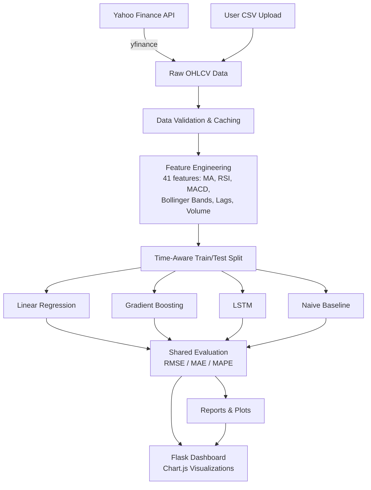
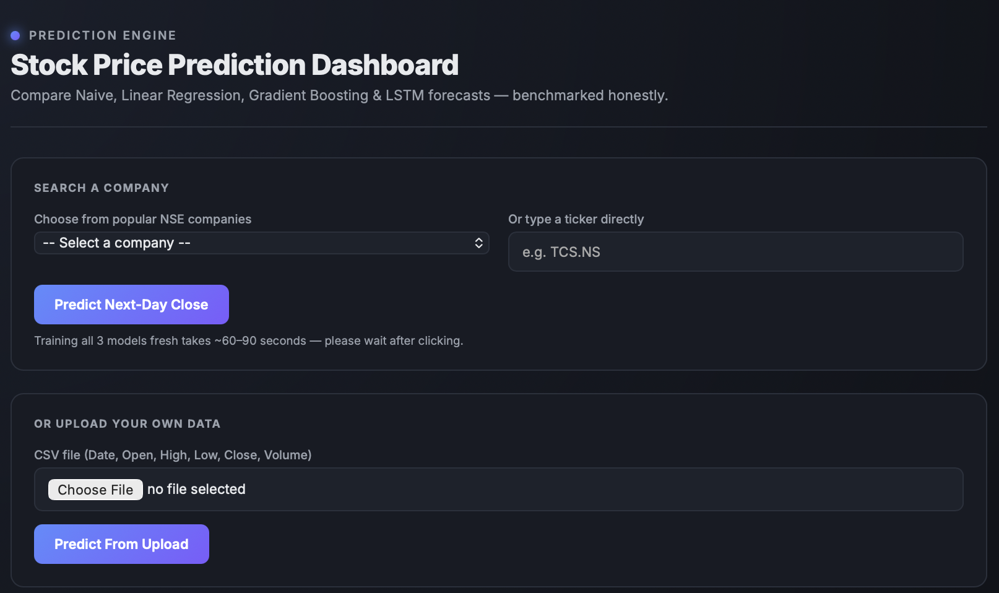
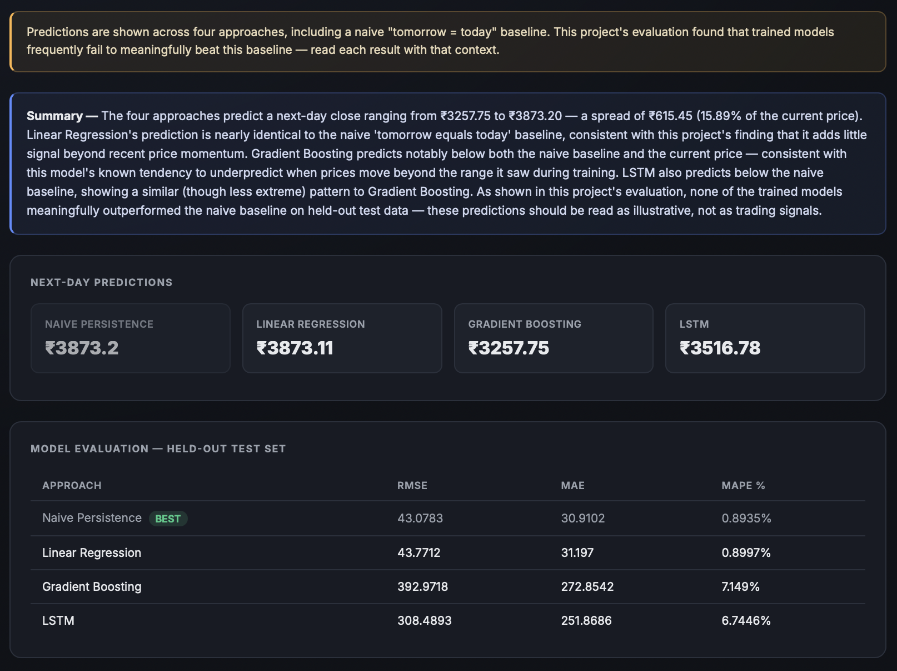
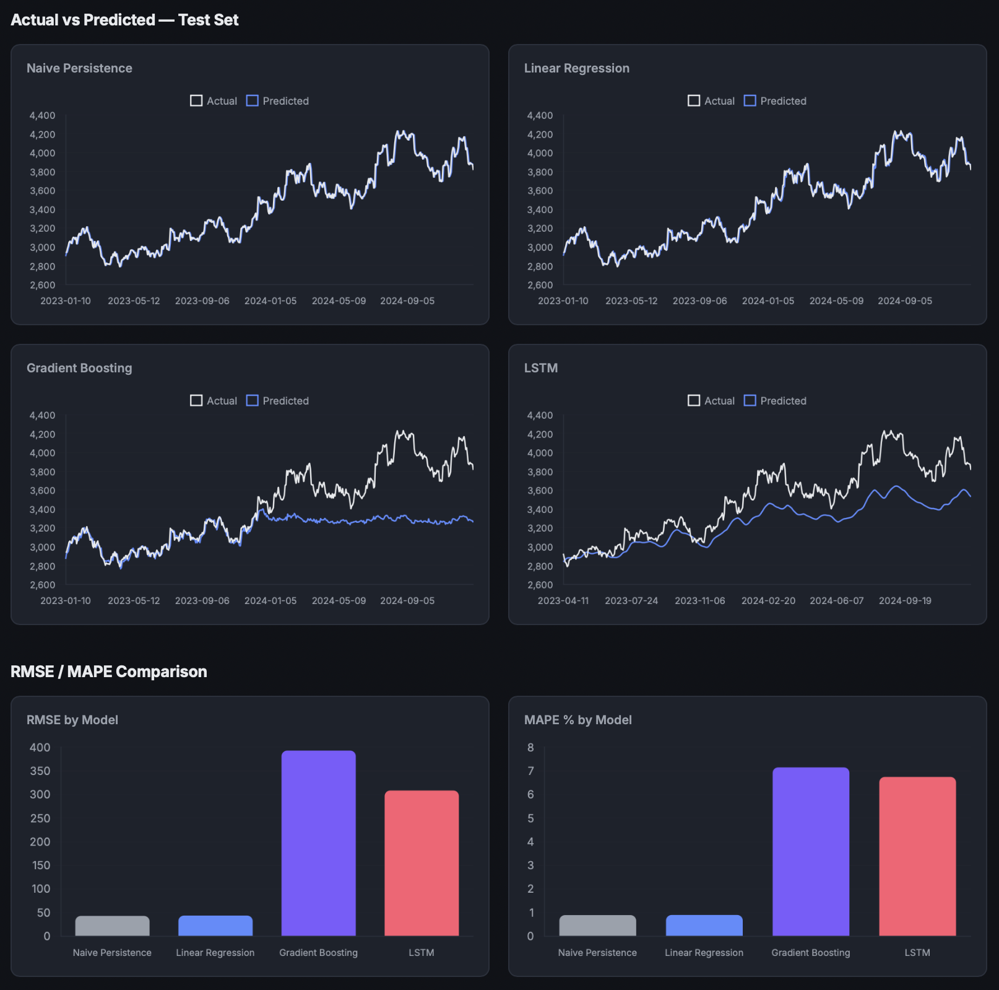

# Stock Price Prediction — RELIANCE.NS

A comparative study of three forecasting approaches — **Linear Regression**, **Gradient Boosting (XGBoost)**, and **LSTM** — for next-day stock price prediction, benchmarked honestly against a naive baseline, with a deployed Flask app for live predictions.

> **Key finding:** none of the three trained models meaningfully outperformed a naive "tomorrow = today" baseline on held-out test data. This project documents *why*, with supporting visual evidence — a finding that's arguably more valuable than a low error metric alone.

---

## Features

- **Interactive dashboard** — dark-themed, card-based UI with live Chart.js charts (not static images) for actual-vs-predicted comparison and RMSE/MAPE bars
- **Multi-company search** — predict next-day close for any of ~30 popular NSE companies via dropdown, or any ticker typed directly (e.g. `TCS.NS`)
- **Manual CSV upload** — bring your own historical OHLCV data (standard Yahoo Finance export format) and get predictions without needing a ticker symbol at all
- **On-demand full retraining** — searching a new company trains fresh Naive, Linear Regression, Gradient Boosting, and LSTM models live, evaluated on that company's own held-out test data — not just a lookup against pre-computed results
- **Rule-based narrative summary** — plain-English commentary on each prediction set, generated with zero external API cost, structured so it can be swapped for a real LLM call later with no other code changes

---

## Table of Contents
- [Problem Statement](#problem-statement)
- [Architecture](#architecture)
- [Live Demo](#live-demo)
- [Results](#results)
- [Key Finding: Why the Naive Baseline Wins](#key-finding-why-the-naive-baseline-wins)
- [Project Structure](#project-structure)
- [Methodology](#methodology)
- [Feature Engineering](#feature-engineering)
- [Tech Stack](#tech-stack)
- [How to Run](#how-to-run)
- [Challenges Faced](#challenges-faced)
- [Key Learnings](#key-learnings)
- [Limitations](#limitations)
- [Future Work](#future-work)

---

## Problem Statement

Can technical indicators derived from historical OHLCV data meaningfully predict the next day's closing price of a stock? This project builds and fairly compares three modeling approaches against Reliance Industries (NSE: RELIANCE) daily price data, and — critically — benchmarks every result against the simplest possible forecast to determine whether any model adds real predictive value.

Most stock prediction projects report an error metric (RMSE, MAPE) in isolation, which can look deceptively good without context. This project treats that as a starting point, not an endpoint, and asks: *compared to what?*

---

## Architecture



---

## Live Demo

The dashboard lets you search any NSE-listed company (or type a ticker directly), or upload your own CSV — predictions and evaluation charts are generated live for whatever you choose.

**Search & upload:**


**Predictions & narrative summary:**


**Model evaluation — actual vs predicted, RMSE/MAPE comparison:**


```
python -m app.app
# open http://127.0.0.1:8000
```

**Note:** searching a new company trains all 3 models fresh (~60-90 seconds) — this is intentional, not a bug, since it keeps results genuinely specific to that company's own data rather than reusing RELIANCE-trained models.

---

## Results

| Approach | RMSE | MAE | MAPE |
|---|---|---|---|
| **Naive Persistence** | 16.88 | 11.94 | 0.93% |
| Linear Regression | 17.32 | 12.39 | 0.96% |
| LSTM | 108.49 | 85.16 | 6.06% |
| Gradient Boosting | 153.79 | 107.98 | 7.61% |

*Lower is better across all metrics. Full results in [`reports/model_comparison.json`](reports/model_comparison.json).*


---

## Key Finding: Why the Naive Baseline Wins

The naive baseline — simply predicting tomorrow's close as equal to today's close — **outperformed every trained model**, including Linear Regression. This is a well-documented characteristic of short-horizon (1-day-ahead) stock price prediction: at daily granularity, price series behave close to a random walk, and technical indicators derived purely from price/volume history carry limited additional signal over the most recent price itself.

**Why Gradient Boosting and LSTM underperformed even more severely than Linear Regression:**

Reliance's stock price trended upward through the training period (2015–2023). The test period (2023–2024) reached price levels the models had never seen during training — visible in the chart above as a rally starting mid-2024.

- **Gradient Boosting** (tree-based) cannot extrapolate beyond the range of target values seen during training, by construction — predictions are bounded by training-set leaf values. Its predicted line visibly plateaus during the 2024 rally instead of tracking the rise.
- **LSTM** is less rigidly bounded, but its internal recurrent activations (tanh-based) saturate for inputs far outside the training range, producing a milder version of the same effect.
- **Linear Regression** extrapolates linearly by construction, giving it a structural advantage on a trending series — though the naive baseline comparison shows it isn't learning much beyond recent momentum either.

Full write-up in [`reports/limitations_report.md`](reports/limitations_report.md).

---

## Project Structure

```
stock-price-prediction/
├── data/
│   ├── raw/                    # cached yfinance pulls
│   └── processed/              # engineered feature set
├── notebooks/                  # exploratory analysis
├── src/
│   ├── data_loader.py          # fetch + cache + validate
│   ├── feature_engineering.py  # 41 technical indicators & features
│   ├── train_lr.py             # Linear Regression baseline
│   ├── train_gb.py             # Gradient Boosting (XGBoost)
│   ├── train_lstm.py           # LSTM (sequence-based)
│   ├── naive_baseline.py       # naive persistence benchmark
│   ├── evaluate.py             # shared RMSE/MAE/MAPE logic
│   ├── generate_report.py      # plots + auto-written limitations report
│   ├── company_lookup.py       # company name -> ticker mapping for search
│   └── on_demand_predictor.py  # live full-retrain pipeline for any ticker/CSV
├── models/                     # saved model weights & scalers
├── app/
│   ├── app.py                  # Flask app (default view + search + upload)
│   ├── templates/index.html    # dashboard UI with Chart.js
│   └── uploads/                # temp storage for uploaded CSVs (cleared after use)
├── reports/                    # generated plots + limitations report
├── config.py                   # all tunable parameters, single source of truth
└── requirements.txt
```

---

## Methodology

1. **Data ingestion** — 10 years of daily OHLCV data for RELIANCE.NS via `yfinance`, cached locally, validated for missing values and sort order.
2. **Feature engineering** — 41 features: SMA/EMA (5/10/20/50-day), RSI-14, MACD, Bollinger Bands, lag features (1/2/3/5/10-day), rolling volatility/range stats, volume features.
3. **Time-aware train/test split** — the most recent 20% of the timeline held out as test data. No shuffling — time series data must never be randomly split, to avoid leaking future information into training.
4. **Three models trained** on identical features and split, evaluated with identical metrics for a fair comparison.
5. **Naive baseline** computed on the same test set for honest benchmarking.
6. **Auto-generated report** — plots and a written limitations analysis, generated directly from saved results (not hand-written after the fact).
7. **Flask deployment** — serves live next-day predictions from all four approaches with a rule-based narrative summary.

---

## Feature Engineering

41 features were engineered from raw OHLCV data, grouped by category:

| Category | Features | Purpose |
|---|---|---|
| **Trend** | SMA & EMA (5/10/20/50-day) | Capture short- and long-term price direction |
| **Momentum** | RSI-14, MACD (line, signal, histogram) | Identify overbought/oversold conditions and momentum shifts |
| **Volatility** | Bollinger Bands (upper/lower/middle/width) | Capture price dispersion and breakout potential |
| **Historical Reference** | Lag features (1/2/3/5/10-day close) | Let tree-based models "see" recent history without native sequence support |
| **Rolling Statistics** | Rolling std/max/min (5/10/20/50-day) | Capture local volatility and price range context |
| **Volume** | % change, rolling average | Volume spikes often precede price moves |

All features are computed with `pandas` rolling/EWM operations, with `inf` values (from edge cases like zero-loss RSI windows) explicitly cleaned before being dropped alongside the initial NaN rows created by rolling windows.

---

## Tech Stack

- **Data & Features:** `yfinance`, `pandas`, `numpy`
- **Modeling:** `scikit-learn` (Linear Regression), `xgboost` (Gradient Boosting), `tensorflow`/`keras` (LSTM)
- **Evaluation & Reporting:** `matplotlib` (main analysis), `Chart.js` (live dashboard)
- **Deployment:** `Flask`

---

## How to Run

```bash
# 1. Clone and set up environment
git clone <your-repo-url>
cd stock-price-prediction
python -m venv venv
source venv/bin/activate        # Windows: venv\Scripts\activate
pip install -r requirements.txt

# 2. Run the pipeline in order
python -m src.data_loader
python -m src.feature_engineering
python -m src.train_lr
python -m src.train_gb
python -m src.train_lstm
python -m src.naive_baseline
python -m src.generate_report

# 3. Launch the app
python -m app.app
# open http://127.0.0.1:8000
```

---

## Challenges Faced

- **Extrapolation failure in tree-based and recurrent models** — Gradient Boosting and LSTM both underperformed a naive baseline on trending price data. Diagnosing this required understanding *why*, not just observing the metric: tree-based models are structurally bounded by training-set leaf values, and recurrent activations saturate outside the training range. This became the project's central finding rather than a bug to hide.
- **Division-by-zero producing `inf` values** — RSI's `avg_gain / avg_loss` calculation and volume percentage change both produced `inf` on certain low-volatility windows for some companies (not RELIANCE, but others tested via the multi-company search feature), silently breaking `sklearn`'s input validation downstream. Fixed by explicitly replacing `inf`/`-inf` with `NaN` before the existing NaN-drop step, rather than patching each calculation individually.
- **Keras 3 model serialization** — the legacy `.h5` save format failed to reload compiled metrics correctly under Keras 3 (`Could not deserialize 'keras.metrics.mse'`). Resolved by switching to the native `.keras` format across both training and inference code.
- **Environment/platform issues** — XGBoost's compiled library failed to load on macOS due to a missing OpenMP runtime (`libomp.dylib`), requiring a Homebrew install. Chrome also silently blocks certain "unsafe" ports (5060, used initially, is reserved for SIP/VoIP) — surfaced as a confusing `ERR_UNSAFE_PORT` with no server-side error at all.

## Key Learnings

- **A model's error metric means nothing without a baseline.** A 0.96% MAPE looks impressive in isolation; benchmarked against a naive baseline that beats it, the same number tells a completely different story.
- **Simpler models can have structural advantages on specific data shapes.** Linear Regression's ability to extrapolate linearly gave it a real (if modest) edge over more "sophisticated" models on trending series — model complexity and model suitability are not the same thing.
- **Reproducibility requires explicit design choices**, not just working code: time-aware (non-shuffled) splits, scalers fit only on training data, and cached raw data all exist specifically to prevent subtle leakage or non-reproducible results.
- **Generalizing a pipeline exposes edge cases a single-dataset pipeline never surfaces.** The `inf` value bug only appeared once the project was extended to arbitrary companies — a reminder that "works on my data" and "works in general" are different bars.

---

## Limitations

- Predicts only 1 day ahead — no claim is made about longer-horizon accuracy or trading usefulness.
- Trained on a single ticker (RELIANCE.NS) — findings may not generalize across stocks, sectors, or market regimes.
- Feature set is limited to price/volume-derived technical indicators — no fundamental data, news sentiment, or macroeconomic signals.
- No transaction costs, slippage, or trading constraints modeled — this project evaluates prediction accuracy only, not trading strategy viability.

## Future Work

- Reframe the target as **direction** (up/down) or **volatility** rather than exact price — may carry more learnable signal at daily granularity.
- Extend the prediction horizon (5-day, 20-day) where trend/momentum effects may be more learnable.
- Incorporate external features: sector indices, news sentiment, macroeconomic indicators.
- Apply de-trending or differencing to the target so tree-based and neural models aren't penalized by the same extrapolation issue found here.