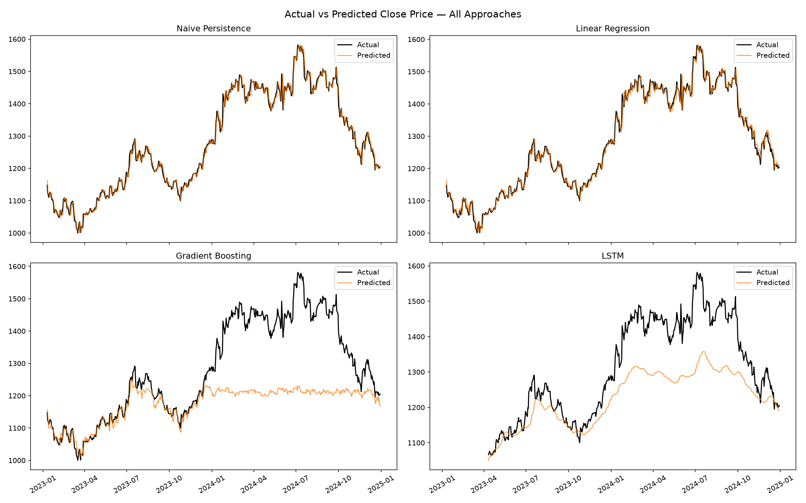
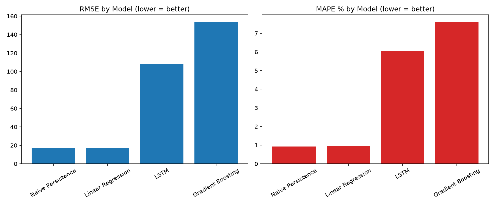

# Stock Price Prediction — RELIANCE.NS

A comparative study of three forecasting approaches — **Linear Regression**, **Gradient Boosting (XGBoost)**, and **LSTM** — for next-day stock price prediction, benchmarked honestly against a naive baseline, with a deployed Flask app for live predictions.

> **Key finding:** none of the three trained models meaningfully outperformed a naive "tomorrow = today" baseline on held-out test data. This project documents *why*, with supporting visual evidence — a finding that's arguably more valuable than a low error metric alone.

---

## Table of Contents
- [Problem Statement](#problem-statement)
- [Live Demo](#live-demo)
- [Results](#results)
- [Key Finding: Why the Naive Baseline Wins](#key-finding-why-the-naive-baseline-wins)
- [Project Structure](#project-structure)
- [Methodology](#methodology)
- [Tech Stack](#tech-stack)
- [How to Run](#how-to-run)
- [Limitations](#limitations)
- [Future Work](#future-work)

---

## Problem Statement

Can technical indicators derived from historical OHLCV data meaningfully predict the next day's closing price of a stock? This project builds and fairly compares three modeling approaches against Reliance Industries (NSE: RELIANCE) daily price data, and — critically — benchmarks every result against the simplest possible forecast to determine whether any model adds real predictive value.

Most stock prediction projects report an error metric (RMSE, MAPE) in isolation, which can look deceptively good without context. This project treats that as a starting point, not an endpoint, and asks: *compared to what?*

---

## Live Demo

The Flask app serves next-day predictions from all four approaches side by side, with an auto-generated narrative summary and the full evaluation report.

*(Add a screenshot or GIF of the running app here)*

```
python -m app.app
# open http://127.0.0.1:5050
```

---

## Results

| Approach | RMSE | MAE | MAPE |
|---|---|---|---|
| **Naive Persistence** | 16.88 | 11.94 | 0.93% |
| Linear Regression | 17.32 | 12.39 | 0.96% |
| LSTM | 108.49 | 85.16 | 6.06% |
| Gradient Boosting | 153.79 | 107.98 | 7.61% |

*Lower is better across all metrics. Full results in [`reports/model_comparison.json`](reports/model_comparison.json).*





---

## Key Finding: Why the Naive Baseline Wins

The naive baseline — simply predicting tomorrow's close as equal to today's close — **outperformed every trained model**, including Linear Regression. This is a well-documented characteristic of short-horizon (1-day-ahead) stock price prediction: at daily granularity, price series behave close to a random walk, and technical indicators derived purely from price/volume history carry limited additional signal over the most recent price itself.

**Why Gradient Boosting and LSTM underperformed even more severely than Linear Regression:**

Reliance's stock price trended upward through the training period (2015–2023). The test period (2023–2024) reached price levels the models had never seen during training — visible in the chart above as a rally starting mid-2024.

- **Gradient Boosting** (tree-based) cannot extrapolate beyond the range of target values seen during training, by construction — predictions are bounded by training-set leaf values. Its predicted line visibly plateaus during the 2024 rally instead of tracking the rise.
- **LSTM** is less rigidly bounded, but its internal recurrent activations (tanh-based) saturate for inputs far outside the training range, producing a milder version of the same effect.
- **Linear Regression** extrapolates linearly by construction, giving it a structural advantage on a trending series — though the naive baseline comparison shows it isn't learning much beyond recent momentum either.

Full write-up in [`reports/limitations_report.md`](reports/limitations_report.md).

---

## Project Structure

```
stock-price-prediction/
├── data/
│   ├── raw/                    # cached yfinance pulls
│   └── processed/              # engineered feature set
├── notebooks/                  # exploratory analysis
├── src/
│   ├── data_loader.py          # fetch + cache + validate
│   ├── feature_engineering.py  # 41 technical indicators & features
│   ├── train_lr.py             # Linear Regression baseline
│   ├── train_gb.py             # Gradient Boosting (XGBoost)
│   ├── train_lstm.py           # LSTM (sequence-based)
│   ├── naive_baseline.py       # naive persistence benchmark
│   ├── evaluate.py             # shared RMSE/MAE/MAPE logic
│   └── generate_report.py      # plots + auto-written limitations report
├── models/                     # saved model weights & scalers
├── app/
│   ├── app.py                  # Flask app
│   └── templates/index.html
├── reports/                    # generated plots + limitations report
├── config.py                   # all tunable parameters, single source of truth
└── requirements.txt
```

---

## Methodology

1. **Data ingestion** — 10 years of daily OHLCV data for RELIANCE.NS via `yfinance`, cached locally, validated for missing values and sort order.
2. **Feature engineering** — 41 features: SMA/EMA (5/10/20/50-day), RSI-14, MACD, Bollinger Bands, lag features (1/2/3/5/10-day), rolling volatility/range stats, volume features.
3. **Time-aware train/test split** — the most recent 20% of the timeline held out as test data. No shuffling — time series data must never be randomly split, to avoid leaking future information into training.
4. **Three models trained** on identical features and split, evaluated with identical metrics for a fair comparison.
5. **Naive baseline** computed on the same test set for honest benchmarking.
6. **Auto-generated report** — plots and a written limitations analysis, generated directly from saved results (not hand-written after the fact).
7. **Flask deployment** — serves live next-day predictions from all four approaches with a rule-based narrative summary.

---

## Tech Stack

- **Data & Features:** `yfinance`, `pandas`, `numpy`
- **Modeling:** `scikit-learn` (Linear Regression), `xgboost` (Gradient Boosting), `tensorflow`/`keras` (LSTM)
- **Evaluation & Reporting:** `matplotlib`, custom evaluation module
- **Deployment:** `Flask`

---

## How to Run

```bash
# 1. Clone and set up environment
git clone <your-repo-url>
cd stock-price-prediction
python -m venv venv
source venv/bin/activate        # Windows: venv\Scripts\activate
pip install -r requirements.txt

# 2. Run the pipeline in order
python -m src.data_loader
python -m src.feature_engineering
python -m src.train_lr
python -m src.train_gb
python -m src.train_lstm
python -m src.naive_baseline
python -m src.generate_report

# 3. Launch the app
python -m app.app
# open http://127.0.0.1:5050
```

---

## Limitations

- Predicts only 1 day ahead — no claim is made about longer-horizon accuracy or trading usefulness.
- Trained on a single ticker (RELIANCE.NS) — findings may not generalize across stocks, sectors, or market regimes.
- Feature set is limited to price/volume-derived technical indicators — no fundamental data, news sentiment, or macroeconomic signals.
- No transaction costs, slippage, or trading constraints modeled — this project evaluates prediction accuracy only, not trading strategy viability.

## Future Work

- Reframe the target as **direction** (up/down) or **volatility** rather than exact price — may carry more learnable signal at daily granularity.
- Extend the prediction horizon (5-day, 20-day) where trend/momentum effects may be more learnable.
- Incorporate external features: sector indices, news sentiment, macroeconomic indicators.
- Apply de-trending or differencing to the target so tree-based and neural models aren't penalized by the same extrapolation issue found here.